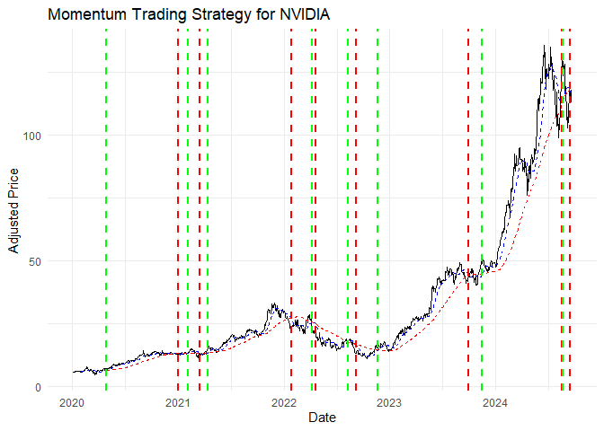

AI Trading Strategies in R
================

## Purpose

This repository contains R code implementations of some popular trading
strategies: the Fibonacci trading strategy and the momentum trading
strategy. Both strategies are implemented using the `tidyverse` syntax
and are demonstrated on historical stock price data for NVIDIA (NVDA).

More will come and I encourage you to contribute to this repository by
adding more trading strategies or improving the existing ones.

This document will evolve over time.

## Strategy 1: Fibonacci Trading Strategy

The Fibonacci trading strategy is a technical analysis strategy that
uses Fibonacci retracement levels to identify potential buy and sell
points in a financial instrument. The strategy is based on the idea that
markets tend to retrace a portion of a previous move before continuing
in the direction of the trend.

The Fibonacci trading strategy is implemented in the
`fibonacci_strategy()` function in the `fibonacci_strategy.R` script.
The function takes a data frame of historical prices and a lookback
period as input and returns a data frame with trading signals based on
Fibonacci retracement levels.

Each file has as it’s first line a comment that starts with `Transcrip:`
and contains a URL to the original question. This is useful to keep
track of the source of the code snippet.

Here is an example of how to apply the Fibonacci trading strategy to
NVIDIA stock price data:

``` r
library(tidyverse)
library(tidyquant)

source("fibonacci_strategy.R")

# Get NVIDIA data using tidyquant
NVDA <- tq_get("NVDA", from = "2024-01-01", to = Sys.Date())

# Apply the strategy
NVDA$signals <- fibonacci_strategy(NVDA)

# View the results
tail(NVDA)
#> # A tibble: 6 × 9
#>   symbol date        open  high   low close    volume adjusted signals
#>   <chr>  <date>     <dbl> <dbl> <dbl> <dbl>     <dbl>    <dbl>   <dbl>
#> 1 NVDA   2024-09-16  117.  118.  114.  117. 248772300     117.       0
#> 2 NVDA   2024-09-17  118.  119.  115.  116. 231925900     116.       0
#> 3 NVDA   2024-09-18  116.  118.  113.  113. 310318900     113.       0
#> 4 NVDA   2024-09-19  117.  120.  117.  118. 293506400     118.       1
#> 5 NVDA   2024-09-20  117.  119.  115.  116  382462400     116        0
#> 6 NVDA   2024-09-23  117.  117.  115.  116. 205808500     116.       0

# Plot the closing prices and trading signals
ggplot(NVDA, aes(x = date, y = adjusted)) +
  geom_line() +
  geom_point(data = NVDA[NVDA$signals == 1, ], aes(color = "Buy")) +
  geom_point(data = NVDA[NVDA$signals == -1, ], aes(color = "Sell")) +
  labs(title = "Fibonacci Strategy for NVIDIA", y = "Adjusted Price", x = "Date",
       color = "Signal") +
  theme_minimal()
```


## Strategy 2: Momentum Trading Strategy

The momentum trading strategy is a trend-following strategy that aims to
capture gains in a financial instrument by buying when the price is
rising and selling when the price is falling. The strategy is based on
the idea that assets that have performed well in the past will continue
to perform well in the future.

The momentum trading strategy is implemented in the
`momentum_strategy()` function in the `momentum_strategy.R` script. The
function takes a data frame of historical prices and a lookback period
as input and returns a data frame with trading signals based on momentum
indicators.

Here is an example of how to apply the momentum trading strategy to
NVIDIA stock price data:

``` r
source("momentum_strategy.R")

# Get NVIDIA data using tidyquant
NVDA <- tq_get("NVDA", from = "2020-01-01", to = Sys.Date())

# Apply the strategy
NVDA_strategy <- momentum_strategy(NVDA, short_window = 20)

# View the results
tail(NVDA_strategy)
#> # A tibble: 6 × 11
#>   symbol date        open  high   low close    volume adjusted short_ma long_ma
#>   <chr>  <date>     <dbl> <dbl> <dbl> <dbl>     <dbl>    <dbl>    <dbl>   <dbl>
#> 1 NVDA   2024-09-16  117.  118.  114.  117. 248772300     117.     118.    119.
#> 2 NVDA   2024-09-17  118.  119.  115.  116. 231925900     116.     118.    119.
#> 3 NVDA   2024-09-18  116.  118.  113.  113. 310318900     113.     117.    119.
#> 4 NVDA   2024-09-19  117.  120.  117.  118. 293506400     118.     116.    119.
#> 5 NVDA   2024-09-20  117.  119.  115.  116  382462400     116      116.    119.
#> 6 NVDA   2024-09-23  117.  117.  115.  116. 205808500     116.     115.    119.
#> # ℹ 1 more variable: signal <chr>

# Create a data frame for buy/sell points with colors
buy_sell_points <- NVDA_strategy %>%
  filter(signal != lag(signal, default = "hold")) %>%
  select(date, signal) %>%
  mutate(color = ifelse(signal == "buy", "green", "red"))

ggplot(NVDA_strategy, aes(x = date, y = adjusted)) +
  geom_line() +
  geom_line(aes(y = short_ma), color = "blue", linetype = "dashed") +
  geom_line(aes(y = long_ma), color = "red", linetype = "dashed") +
  geom_vline(
    data = buy_sell_points, 
    aes(xintercept = date, color = color),
    linetype = "dashed",
    linewidth = 1
    ) +
  labs(title = "Momentum Trading Strategy for NVIDIA",
       x = "Date",
       y = "Adjusted Price",
       fill = "Signal") +
  theme_minimal() +
  scale_color_identity() +
  # Map fill colors
  scale_fill_manual(values = c("hold" = "white", "buy" = "green", "sell" = "red")) 
```



## Strategy 3: Moving Average Crossover Strategy

The moving average crossover strategy is a trend-following strategy that
aims to capture gains in a financial instrument by buying when a
short-term moving average crosses above a long-term moving average and
selling when the short-term moving average crosses below the long-term
moving average. The strategy is based on the idea that assets that have
performed well in the past will continue to perform well in the future.

``` r
source("moving_average_strategy.R")

# Define the stocks
symbols <- c("AAPL", "MSFT", "NVDA", "F", "GM", "TSLA") 

# Download historical data (replace with your preferred source if needed)
start_date <- "2020-01-01"
end_date <- "2023-11-24" 
data <- tq_get(symbols,
               from = start_date,
               to = end_date,
               get = "stock.prices")

# Plotting for AAPL as an example
ggplot(data_with_signals, aes(x = date, y = adjusted)) +
  facet_wrap(~symbol, scales = "free_y") +
  geom_line() +
  geom_line(aes(y = short_ma), color = "blue") +
  geom_line(aes(y = long_ma), color = "red") +
  labs(title = "Moving Average Trading Strategy for: AAPL, MSFT, NVDA, F, GM, TSLA",
       x = "Date",
       y = "Adjusted Price") +
  theme_minimal() 
```


``` r

# Apply the strategy
short_window <- 20
long_window <- 50 
data_with_signals <- data |>
  calculate_ma_strategy(short_window, long_window)

first_signals <- data_with_signals |>
  get_first_signals()

ggplot(data_with_signals, aes(x = date, y = adjusted)) +
  facet_wrap(~symbol, scales = "free_y") +
  geom_line() +
  geom_line(aes(y = short_ma), color = "blue") +
  geom_line(aes(y = long_ma), color = "red") +
  geom_point(data = first_signals %>% filter(signal == "buy"), 
             color = "green", size = 3) +
  geom_point(data = first_signals %>% filter(signal == "sell"), 
             color = "red", size = 3) +
  labs(title = "Moving Average Trading Strategy for: AAPL, MSFT, NVDA, F, GM",
       x = "Date",
       y = "Adjusted Price") +
  theme_minimal()
```


